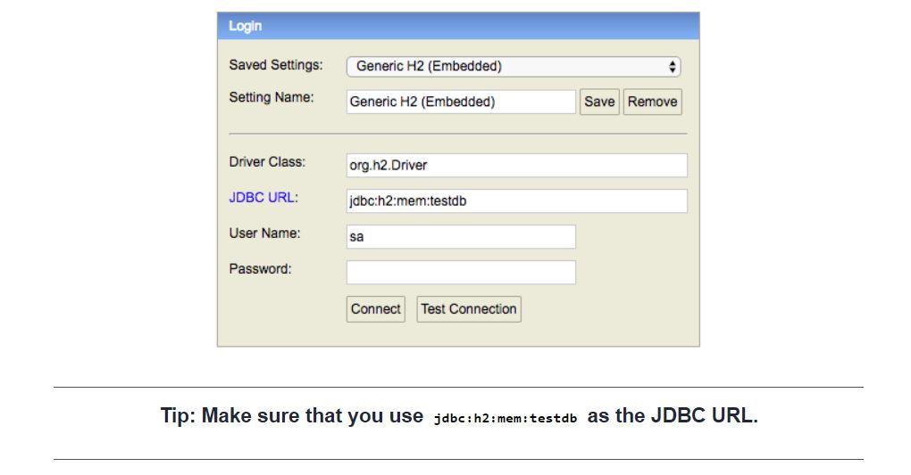

# Generic Search Engine - Proof of concepts

### Guides
The following guides illustrate how to use this API:

* This generic search engine will generate the SQL where clause dynamically based on the input parameter.
* It will be helpful when there are lots of search criteria to search an object
* It reduces the NULL checking of the input parameter to build the query with 'where' clause
* GET URL to access the search API [http://localhost:8080/api/v1/customer?fname=sam&lname=yan&phone=1111&email=sam@gmail.com](http://localhost:8080/api/v1/customer?fname=sam&lname=yan&phone=1111&email=sam@gmail.com)
* To access in memory H2 DB click [http://localhost:8080/h2-console](http://localhost:8080/h2-console)
  
  
#### Example
1. Say, we have a 'Customer' and it has 50 attributes, e.g. firstname, lastname, email, ssn, phone
2. But you want to search the customer with only firstname.
3. You are not sure what are the values user will provide to search a 'customer'. User may provide 1 attribute or 10 attribute during search. 
4. Then you need to check what are the parameters of the object is **NOT NULL**, based on that you need to generate the 'where' clause of the SQL
5. Per our example, if you want to search the customer by firstname only, you need to trigger a SQL as 
`SELECT * FROM CUSTOMER WHERE FNAME LIKE %SAM%;`
6. With the help of this API, you don't have to bother about the checking which attributes of the 'customer' object is present or not
7. It will generate the 'where' clause of the query dynamically based on the NOT NULL value of the input object
8. This API also has the intelligence to _inspect_ the **attribute** type. If the input type is **Integer**, then it will generate the query with operator **=**
If the attribute type is '**String**' then it can generate a SQL as **like** search query e.g. **LIKE %SAM%**
For string parameter you can also generate a SQL with **=** operator
9. To enable this intelligence all you need to do is configure the API
10. Sample output of the generated SQL by the search engine as below    
    -   `Generated SQL ::: UPPER(customer.fname) like '%SAM%' AND UPPER(customer.lname) like '%YAN%' AND customer.email='sam@gmail.com' AND customer.phone=1111`
11. Once the where clause is generated then you can append this clause with your desired SQL to build the full SQL and trigger that in DB, like below
    - `select * from customer where UPPER(customer.fname) like '%SAM%' AND UPPER(customer.lname) like '%YAN%' AND customer.email='sam@gmail.com' AND customer.phone=1111`

